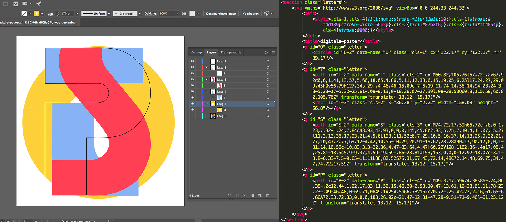

# Web-animatie
In deze repositorie staat mijn werk van het vak web-animatie van de minor Visual Interface Design. Tijdens dit vak heb ik een poster digitaal gemaakt en door gebruik van interactie geanimeerd. Dit is gedaan door het gebruik van de programmeertalen HTML, CSS en JavaScript. Hieronder licht ik mijn proces en eindresultaat toe.

# Het uitgekozen kunstwerk

Het kunstwerk dat ik heb uitgekozen voor de opdracht is afkomstig uit de Online Letterform Archive. Het kunstwerk is een poster voor een systeemfont genaamd 'Stop'. Dit font is ontworpen door Aldo Novarese en is uitgebracht in het jaar 1971. De poster is de voorkant van het promotieboekje van het Stop font. Het font is gemaakt omdat er aanvankelijk geen leuke en humoristische fonts beschikbaar waren. Met dit font is gebrobeerd hierop in te spelen. De letters hebben een futuristische uitstraling en zijn soms ook alleen maar te lezen in combinatie met andere letters. Ik werd door dit kunstwerk aangesproken door de mooie kleurencombinatie en de verschillende kleur mengsels. Ook vond ik de geometrische samenstelling van het kunstwerk een mooie toevoeging. 


>Artwork by: Aldo Novarese

>Decade: 1971

>Found on:
[Online Archive](http://oa.letterformarchive.org/item?workID=lfa_pintori_0041&LFAPics=Yes)

# Workflow


## Concept
Ik had al direct veel ideeën voor interacties en beweging in het ontwerp. Omdat het lettertype is ontworpen om in te spelen op speelse lettertypes vond ik het een mooie uitdaging om een speels ontwerp te maken. Hierbij wou ik de gebruiker een rol geven van oneindige creativiteit die los te laten is op verschillende manieren op het digitale kunstwerk.

Ik ben begonnen met het maken van het kunstwerk in Illustrator. Hier heb ik de verschillende letters in verschillende lagen geplaatst. Op deze manier zijn deze later makkelijk te animeren door middel van code. Ik heb de lagen vanuit Illustrator geëxporteerd als SVG en de code hiervan in de HTML geplakt.



Om het kunstwerk precies na te maken heb ik op de letters in de CSS een ``mix-blend-mode:multiply`` geplaatst waardoor de letters dezelfde kleurcombinaties kregen. Ik heb de letters in het midden van het scherm geplaatst omdat deze centraal zijn voor de website. Ik heb door gebruik te maken van Keyframes de letters een zweef effect gegeven om zo aan de gebruiker mee te geven dat de website actief is, daarnaast ziet het er aantrekkelijk en speels uit. Dit is weer terug te koppelen naar het speelse van het lettertype.

## Interactie
Om de gebruiker interactie te laten maken met het kunstwerk heb ik verschillende functies toegevoegd. De functies zijn uiteenlopend met betrekking tot interactie, dit heb ik gedaan om zelf te experimenteren met CSS animaties en om de gebruiker een speelse ervaring te geven. 
* Hover effect
* Letter kleur veranderen
* Letter verdeling
* Kleuren omkeren

### Hover effect

De eerste interactie die ik heb toegevoegd is een hover op de titel en subtitel op de pagina. Deze titels zitten niet op het originele kunstwerk maar heb ik toegevoegd om de gebruiker een korte instructie te geven. Wanneer er over de woorden van de titel wordt bewogen met de muis worden de woorden uitvergroot en zullen ze een kleurmix krijgen bestaande uit de 3 kleuren van het originele kunstwerk. Op de hover animatie zit nog een transition om de overgang iets soepeler te maken. Het kleur geven van de woorden in een gradient van de drie kleuren was nog een beetje tricky maar hier heb ik uiteindelijk met een ``-webkit-background-clip`` een oplossing voor gevonden.

```
h1 span:hover {
  font-size: 6vw;
  transition: .3s ease;
  background-image: linear-gradient(to left, #ff4054, #87b2f6, #fdd139);
  -webkit-background-clip: text;
  color: transparent;
}
```

```
h2 span:hover {
  font-size: 3vw;
  transition: .3s ease;
}
```
