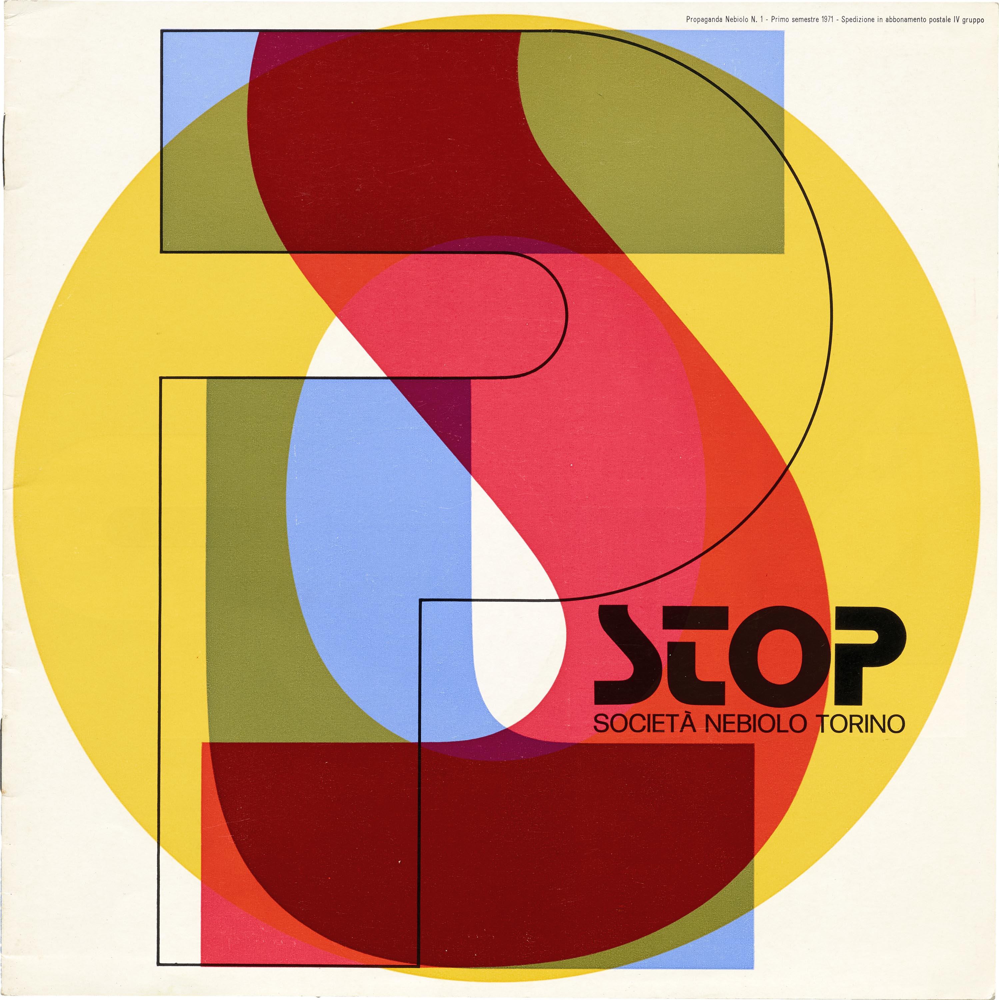

# Web-animatie
In deze repositorie staat mijn werk van het vak web-animatie van de minor Visual Interface Design. Tijdens dit vak heb ik een poster digitaal gemaakt en door gebruik van interactie geanimeerd. Dit is gedaan door het gebruik van de programmeertalen HTML, CSS en JavaScript. Hieronder licht ik mijn proces en eindresultaat toe.

## Het uitgekozen kunstwerk

Het kunstwerk dat ik heb uitgekozen voor de opdracht is afkomstig uit de Online Letterform Archive. De link naar de afbeelding is: http://oa.letterformarchive.org/item?workID=lfa_type_0049&LFAPics=Yes. Het kunstwerk is een poster voor een systeemfont genaamd 'Stop'. Dit font is ontworpen door Aldo Novarese en is uitgebracht in het jaar 1971. De poster is de voorkant van het promotieboekje van het Stop font. Het font is gemaakt omdat er aanvankelijk geen leuke en humoristische fonts beschikbaar waren. Met dit font is gebrobeerd hierop in te spelen. De letters hebben een futuristische uitstraling en zijn soms ook alleen maar te lezen in combinatie met andere letters. 
